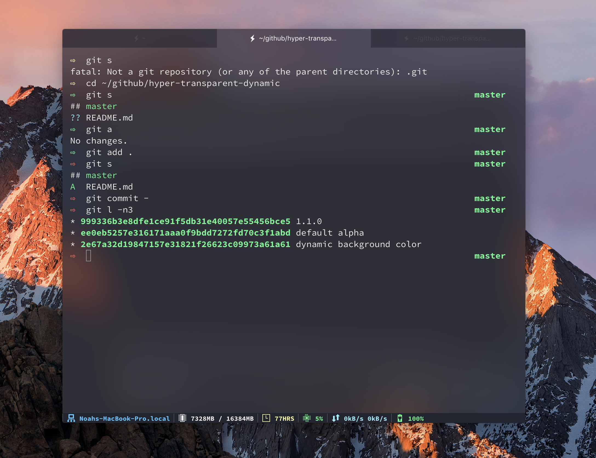

# hyper-transparent-dynamic

Dynamically set the backgroundColor with transparency and apply vibrancy.
Compatible with **any** theme, pulls in existing value and adds alpha.



**Note**: _See example below, load `hyper-transparent-dynamic` *after* your theme plugin._
```
module.exports = {
  ...

  config: {
    ...

    hyperTransparentDynamic: {
      alpha: 0.5 // default 50%
    },

    ...
  },

  plugins: [
    'hyper-snazzy',
    'hyper-transparent-dynamic',
  ],

  ...
}
```
